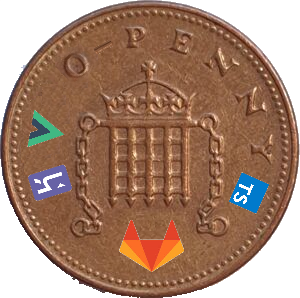

# @zeropenny/create-zp-vue-app

<p align="center"></p>

An application made to generate projects based on [**zeropenny-frontend-starter-kit**](https://github.com/zero-penny-architecture/vuejs-starter-kit).

## Install

You can install globally the tool with `npm` or `yarn` 

``` bash
npm install --global @zeropenny/create-zp-vue-app
# or
yarn global add @zeropenny/create-zp-vue-app
```

## Execute

``` bash
create-zp-vue-app
```

alternatively you can use `npx` to directly the CLI to generate a project without installing

``` bash
npx @zeropenny/create-zp-vue-app
```

You will be asked a set of questions, just fill the answers with the provided data and you will have your new project on the go ;)

## Additional Notes

The template project requires:

- A gitlab repository (wether in cloud or hosted)
- 2 Heroku apps, one for **development** and one for **production** environment. 
  
  You will be prompted for a single name because the two app names must respect the following rule:

  ```
  development heroku app name must be equal to the production app name with a "-dev" suffix.
  ```

  For example, if your "heroku app" field is `my-awesome-app`, you need one heroku app called `my-awesome-app-dev` and one called `my-awesome-app` in your account.
  
  Check the [**`.gitlab-ci.yml` example**](https://github.com/zero-penny-architecture/vuejs-starter-kit/blob/master/.gitlab-ci.yml) for reference.